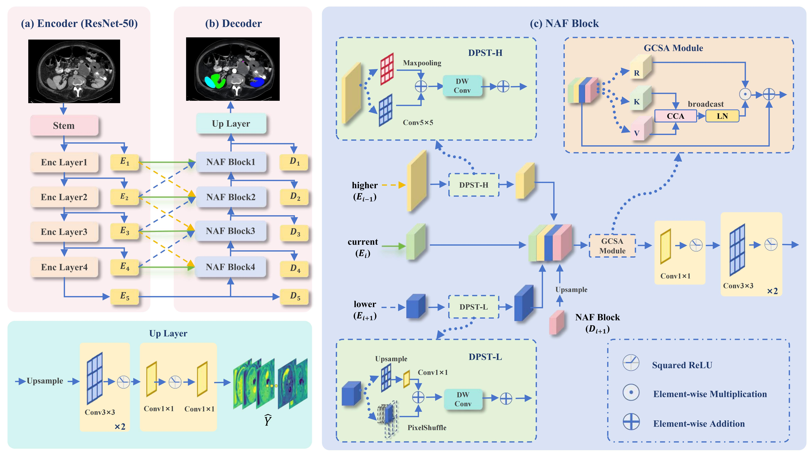
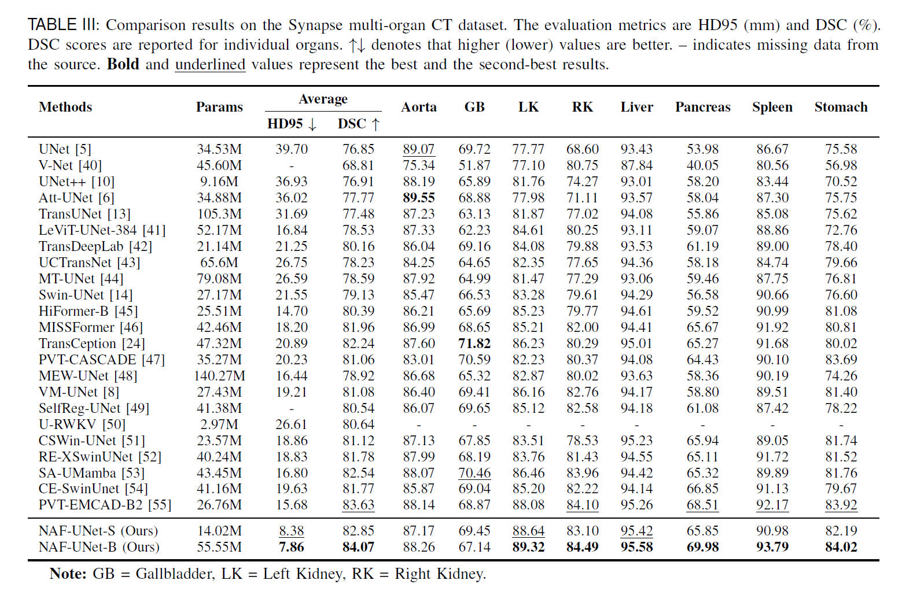
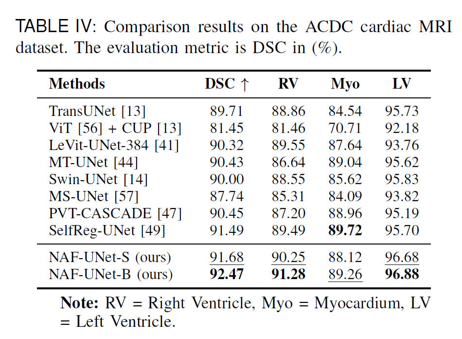
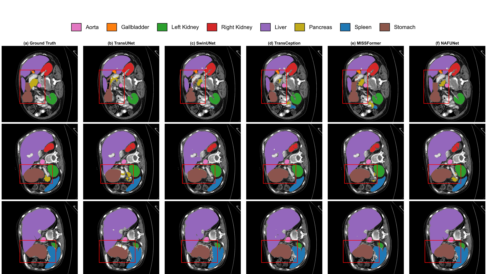

# NAF-UNet
NAF-UNet: Neighbor-Aware Multi-Scale Fusion with Channel Attention for Medical Image Segmentation. A novel encoder-decoder architecture achieving SOTA on Synapse, ACDC, and ISIC benchmarks.

## Architecture

<p align="center">

</p>

## Quantitative Results

<p align="center">

</p>

<p align="center">

</p>


## Qualitative Results

<p align="center">

</p>


## Usage
### 1. Prepare data

Synapse (BTCV preprocessed data) and ACDC data are available at [TransUNet](https://github.com/Beckschen/TransUNet/tree/main)'s repo. 

The directory structure of the whole project is as follows:

```
.
├── NAF-UNet
│   ├──datasets
│   │       └── dataset_*.py
│   ├──train.py
│   ├──test.py
│   ├──...
│   └──data
│        └── Synapse
│        │        ├── test_vol_h5
│        │        │   ├── case0001.npy.h5
│        │        │   └── *.npy.h5
│        │        └── train_npz
│        │          ├── case0005_slice000.npz
│        │          └── *.npz
│        │
│        └──ACDC
│             ├── ACDC_training_volumes
│             │      ├── patient100_frame01.h5
│             │      └── *.h5
│             └── ACDC_training_slices
│                    ├── patient100_frame13_slice_0.h5
│                    └── *.h5   

```
### 2. Environment

Please prepare an environment with python=3.9, and then use the command "pip install -r requirements.txt" for the dependencies.

### 3. Download weights

Pretrained weights can be downloaded at (https://pan.baidu.com/s/18QIV1EHL9TEyvLqLXL5BdA?pwd=hnsi).


### 4. Train/Test

- Run the training script on the Synapse dataset.

```bash
python train.py --dataset Synapse --max_epochs 300 --img_size 224 
```

- Run the test script on the Synapse dataset.

```bash
python test.py --dataset Synapse --max_epochs 300 --img_size 224
```

```
## Acknowledgements
This code base uses certain code blocks and helper functions from [TransUNet](https://github.com/Beckschen/TransUNet/tree/main).

## Citations

``` 

